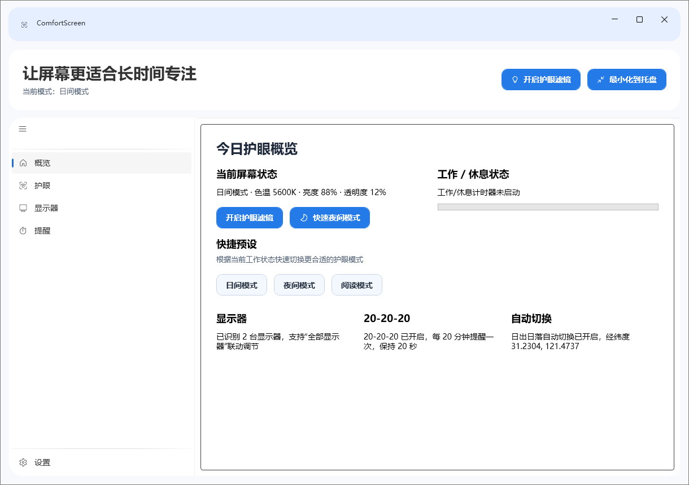

# ComfortScreen

一款基于 `WPF + .NET 8` 构建的桌面护眼软件，采用 `CommunityToolkit.Mvvm`、`Microsoft.Extensions.Hosting` 和 `Wpf.Ui` 实现 MVVM 分层、依赖注入与 Win11 风格界面。



## 功能概览

- 日间模式、夜间模式、阅读模式三种快捷预设，可一键切换。
- 支持色温、亮度、滤镜透明度调节，并可实时应用到当前屏幕。
- 支持多显示器识别与“全部显示器”联动调节。
- 支持定时切换与日出日落自动切换两种自动化护眼策略。
- 内置 20-20-20 护眼提醒，可配置提醒间隔与远眺时长。
- 支持工作 / 休息循环与强制休息遮罩。
- 支持托盘常驻、双击恢复、全局快捷键快速开关。
- 支持浅色 / 暗色主题切换。
- 支持当前用户开机自启，并在登录后静默驻留托盘。

## 快速开始

### 环境要求

- Windows 10 / 11
- .NET 8 SDK

### 安装依赖并构建

```powershell
dotnet build
```

### 启动项目

```powershell
dotnet run
```

### 自启静默启动参数

应用内部使用 `--startup` 参数区分“手动启动”和“开机自启启动”。  
正常开发和日常使用不需要手动传入；只有模拟开机自启场景时才需要：

```powershell
dotnet run -- --startup
```

## 使用说明

### 概览页

- 查看当前护眼模式、亮度、色温和滤镜透明度。
- 快速切换护眼开关与夜间模式。
- 查看显示器状态、20-20-20 提醒状态和自动切换状态。

### 护眼页

- 调整日间 / 夜间 / 阅读模式预设。
- 配置定时切换时间段。
- 配置基于经纬度的日出日落自动切换。

### 显示器页

- 在单个显示器与“全部显示器”之间切换调节目标。
- 调整色温、亮度、透明度并实时生效。

### 提醒页

- 开启或关闭 20-20-20 提醒。
- 配置工作 / 休息循环与强制休息遮罩。
- 立即测试提醒弹窗。

### 设置页

- 配置全局快捷键组合。
- 切换浅色 / 暗色主题。
- 开启或关闭开机登录后自动启动，并查看“启动到托盘”的当前状态提示。

## 配置说明

应用设置保存在当前用户目录：

```text
%LOCALAPPDATA%\ComfortScreen\settings.json
```

配置文件会持久化以下信息：

- 当前主题模式与历史主题兼容字段
- 护眼模式、色温、亮度、透明度
- 自动切换与提醒相关参数
- 多显示器设置
- 快捷键配置
- 开机自启状态

说明：

- 旧版本中的 `Theme` / `ThemeSkin` 仍可兼容读取。
- 开机自启通过当前用户注册表启动项实现，不需要管理员权限。
- 启动异常日志会写入应用运行目录下的 `startup-error.log`。

## 技术栈与架构

- `WPF`：桌面 UI 框架
- `CommunityToolkit.Mvvm`：属性通知、命令和 ViewModel 基础能力
- `Wpf.Ui`：Win11 / Fluent 风格窗口、导航和控件外观
- `Microsoft.Extensions.Hosting`：Host、依赖注入与服务注册

项目采用 `View / ViewModel / Service / Model` 分层：

- `Views`：窗口与页面，包括主壳窗口、提醒窗口和各业务页面
- `ViewModels`：页面状态、命令绑定和 UI 文案整理
- `Services`：主题、托盘、热键、亮度、自启、提醒等平台能力
- `Contracts`：服务接口边界
- `Models`：配置模型、显示器设置、主题选项等基础数据类型
- `Themes`：Win11 风格主题资源与控件样式

## 项目结构

```text
ComfortScreen
├─ Contracts      # 服务接口
├─ Models         # 配置与基础模型
├─ Services       # 平台服务与业务协调器
├─ Themes         # 主题资源与控件样式
├─ ViewModels     # MVVM 视图模型
├─ Views          # 主窗口、弹窗和页面
└─ docs/images    # README 截图资源
```

## 已知说明

- 当前仅支持 Windows。
- 亮度调节、全局快捷键、开机自启等能力与本机系统环境相关，个别机器上可能受权限、驱动或系统策略影响。
- 当前 README 以源码运行方式为主，不包含安装包分发说明。

## 开发备注

- 构建输出默认位于 `bin/` 与 `obj/`。
- 若界面或启动流程异常，可优先检查运行目录下的 `startup-error.log`。
- 如果调整主题、导航或设置页能力，建议同步更新 README 截图与功能说明。
